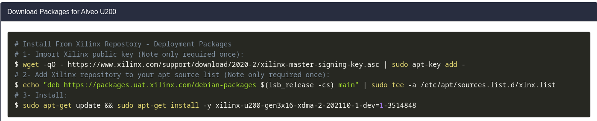

# Instalación predeterminada del paquete correspondiente a la tarjeta u200

La instalación predeterminada de dicho paquete viene expresada en el inicio del apartado [Getting started - Vitis Desing Flow](https://www.xilinx.com/products/boards-and-kits/alveo/u200.html#vitis). Deberemos seleccionar tanto la versión de las herramientas como el Sistema Operativo que vamos a utilizar. 

A fecha de edición de este artículo, la instalación predeterminada a seguir consta de las siguientes instrucciones:



> [!IMPORTANT] 
> Tener en cuenta que en elc aso de estar utilizando una distribución Debian, deberemos indicar en el servidor la correspondiente distribución de Ubuntu correspondiente. Siendo por ejemplo, la distribución *jammy* de Ubuntu correspondiente a la distribución *Bookworm* de Debian. En este caso, la segundo instrucción debería realizarse de la siguiente manera:
>
>```BASH
># 2- Add Xilinx repository to your apt source list (Note only required once):
>$ echo "deb https://packages.uat.xilinx.com/debian-packages jammy main" | sudo tee -a /etc/apt/sources.list.d/xlnx.list
>```

> [!IMPORTANT] 
> En el caso de que se produzca un error al reconocer el servidor de descargas, esto puede deberse a un error en la especificación. Se recomienda seguir el siguiente [enlace](https://support.xilinx.com/s/question/0D54U00007q1ZLUSA2/could-not-resolve-packagesuatxilinxcom?language=en_US).

> [!IMPORTANT] 
> Es probable que tras la realización de los pasos anteriores, sea necesario llevar a cabo la instalación de la biblioteca *libprotobuf23_3.12.4-1*. Siendo el caso, podemos realizar la instalación manual de dicho paquete mediante las URLs indicadas en el siguiente [enlace](https://debian.pkgs.org/11/debian-main-amd64/libprotobuf23_3.12.4-1+deb11u1_amd64.deb.html). El el siguiente cuadro podemos ver el comando correspondiente para  
>
> ```BASH
>wget http://archive.ubuntu.com/ubuntu/pool/main/p/protobuf/libprotobuf23_3.12.4-1ubuntu7.22.04.1_amd64.deb
>```